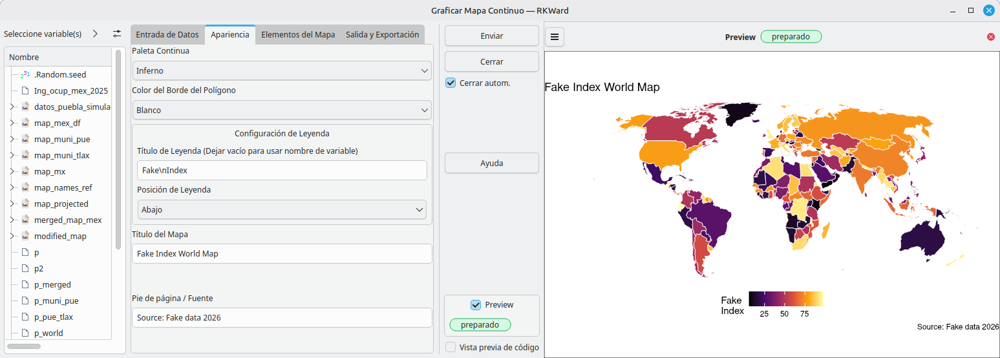

# rk.map.globalities: World & Regional Maps for RKWard


[](https://github.com/AlfCano/rk.map.globalities/actions/workflows/lintr.yml)


**rk.map.globalities** is a specialized spatial data downloader for RKWard. While its sibling plugin (`rk.map.localities`) focuses on high-resolution municipalities, this plugin focuses on the **Big Picture**: Continents, Subregions, and the World.

It leverages `rnaturalearth` to fetch country boundaries and includes a built-in **Projection Engine** to ensure your global maps look professional (e.g., Robinson or Winkel Tripel) rather than distorted.

## 🚀 Features

### 1. Macro-Region Filtering
Easily download specific parts of the world without needing to know complex ISO codes.
*   **The Americas:** One-click download for the "New World" (North + South America + Caribbean).
*   **Afro-Eurasia:** Instantly get the "Old World" (Africa + Europe + Asia).
*   **Subregions:** Specific filters for **The Middle East** (West Asia), **Sub-Saharan Africa**, **Southeast Asia**, and more.

### 2. Aesthetic Projections (Built-in)
Raw spatial data usually comes in "Plate Carrée" (Lat/Lon), which makes the world look stretched at the poles. This plugin fixes that automatically.
*   **Robinson:** The classic "National Geographic" look.
*   **Winkel Tripel:** Low distortion, standard for world atlases.
*   **Mollweide:** Equal-area projection (great for density comparisons).
*   **Mercator:** Web-standard (though not recommended for global thematic maps).

### 3. Thematic Map Best Practices
*   **Antarctica Toggle:** Automatically exclude Antarctica with a single checkbox. This is a best practice for choropleth maps (heatmaps) to save vertical space and focus on human geography.
*   **Resolution Control:** Choose between Low (1:110m) for fast previews or Medium (1:50m) for publication-quality borders.

## 📦 Installation

To install this plugin in RKWard, run the following code in your R Console:

```R
# install.packages("devtools")
local({
  require(devtools)
  install_github("AlfCano/rk.map.globalities", force = TRUE)
})
```

**System Requirements:**
This plugin relies on the `sf` package. On Linux (Ubuntu/Debian), ensure you have the system libraries installed:
`sudo apt-get install libudunits2-dev libgdal-dev libgeos-dev`

## 🌍 Internationalization

The interface is fully localized to match your RKWard language settings:

*   🇺🇸 **English** (Default)
*   🇪🇸 **Spanish** (`es`)
*   🇫🇷 **French** (`fr`)
*   🇩🇪 **German** (`de`)
*   🇧🇷 **Portuguese** (Brazil) (`pt_BR`)

## 💻 Usage

Once installed, find the tool under:

**`Plots` -> `Maps` -> `Download Global/Regional Maps`**

1.  **Select Region:** Choose "Whole World", "Americas", "Europe", etc.
2.  **Map Resolution:** "Medium" is recommended for most uses.
3.  **Options:** Check "Exclude Antarctica" for a cleaner look.
4.  **Projection:** Select "Robinson" (or your preferred style).
5.  **Save Object:** Name your map object (default: `world_map`).

## 🎓 Quick Start Example

**Scenario:** Creating a "Digital Access" Choropleth map of the World in Robinson projection.

### Step 1: Download and Project
1.  Open **Download Global/Regional Maps**.
2.  **Region:** `Whole World`.
3.  **Exclude Antarctica:** `Checked`.
4.  **Projection:** `Robinson (Standard World Map)`.
5.  **Save As:** `world_robinson`.
6.  Click **Submit**.

    

### Step 2: Create Dummy Data
Since we need data to plot, run this in the R Console to generate fake values for the countries we just downloaded.

```R
# Extract names from the downloaded map to ensure matching
if (exists("world_robinson")) {
  set.seed(2025)
  world_fake_data <- data.frame(
    Country_Name = world_robinson$name,
    Digital_Index = runif(nrow(world_robinson), min = 5, max = 98)
  )
}
```

### Step 3: Visualize (Using rk.rnaturalearth)
This plugin pairs perfectly with the **Plot Continuous Map** tool from `rk.rnaturalearth`.

1.  Open **Plots -> Maps -> Plot Continuous Map**.
2.  **Map Object:** `world_robinson`.
3.  **Map Id Column:** `name`.
4.  **Data Frame:** `world_fake_data`.
5.  **Region Name Column:** `Country_Name`.
6.  **Value Column:** `Digital_Index`.
7.  **Click Submit.**

    

## 🛠️ Dependencies

*   `rnaturalearth` (Data source)
*   `sf` (Spatial transformation)
*   `dplyr` (Filtering)

## ✍️ Author & License

*   **Author:** Alfonso Cano (<alfonso.cano@correo.buap.mx>)
*   **Assisted by:** Gemini, a large language model from Google.
*   **License:** GPL (>= 3)
